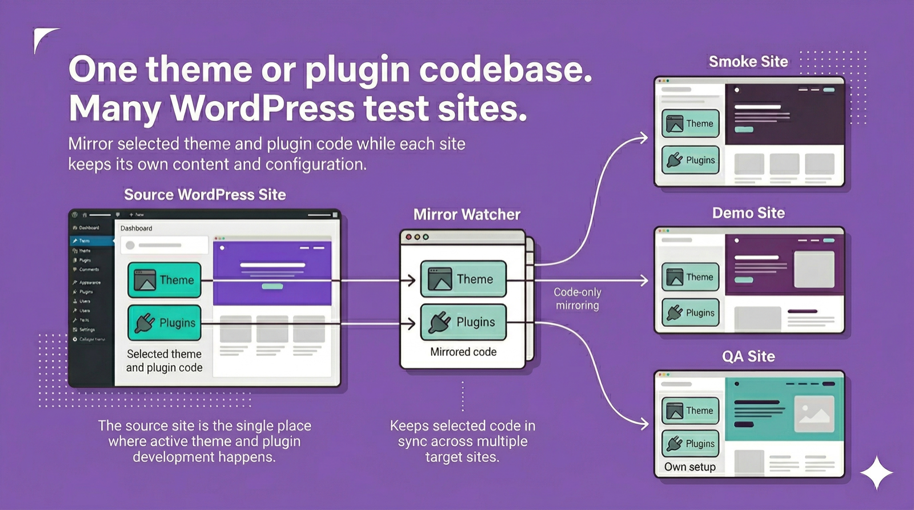

<p align="center">
  
</p>

# WP Code Mirror

> One theme or plugin codebase. Many WordPress test sites.

WP Code Mirror is a local-first workflow tool for WordPress developers who need
to test the same in-development theme or plugin across multiple local sites.
Instead of reinstalling ZIPs, copying folders manually, or maintaining
duplicate code trees, you keep one source of truth and mirror selected code
into your target sites.

> Current status: early macOS-first prototype. The current watcher/service
> flow depends on `rsync`, `jq`, and `launchd`.

## What It Is

- a WordPress admin plugin for mirror configuration and status
- a host-side watcher/service layer that syncs selected theme and plugin code
- a local development workflow for testing the same code across multiple sites

## Who It Is For

WP Code Mirror is for developers who:

- build themes or plugins locally
- test across multiple WordPress installs
- want one active source of truth instead of stale duplicate copies
- are tired of ZIP reinstall loops and manual folder syncing

It is not for:

- production deployment
- content or database migration
- full-site cloning
- cloud-hosted sync workflows

## Why Use This Instead?

If you already have a rough local workflow, WP Code Mirror is meant to replace
the maintenance overhead around it.

- Manual copy breaks down as soon as more than one test site needs to stay up
  to date.
- ZIP reinstalls are repetitive and make quick validation slower than it should
  be.
- Duplicate local copies drift over time and stop reflecting the code you are
  actively developing.
- Symlink-based setups can work, but they are not always the workflow you want
  across multiple WordPress sites, plugin stacks, or local environments.

WP Code Mirror keeps the workflow explicit: choose one source site, choose the
theme/plugin code you are working on, then mirror that code into one or more
target sites for testing.

## Try It Locally

Before you start:

- read the setup guide in [`docs/install.md`](docs/install.md)
- use the sample config in [`config/wp-code-mirror.config.example.json`](config/wp-code-mirror.config.example.json)

Clone the repository directly into your WordPress plugins directory:

```bash
git clone <repo-url> wp-content/plugins/wp-code-mirror
```

Then:

1. activate the `WP Code Mirror` plugin in wp-admin
2. open `Tools -> WP Code Mirror`
3. update the source and target site paths
4. click `Save Config`
5. install and start the watcher for your target site

`config/wp-code-mirror.config.example.json` is optional. Use it if you want to
pre-seed the setup outside wp-admin or keep the first config under file control
from the start. Otherwise the plugin will create a site-local config at
`wp-content/uploads/wp-code-mirror/config/wp-code-mirror.config.json` when you
save the form.

If you want a concrete starting point instead of placeholders, copy
`config/wp-code-mirror.config.example.json`, adjust the site paths and slugs,
then save or import that config into your local setup.

## What It Does

- keeps one local theme or plugin codebase as the source of truth
- mirrors that code into one or more WordPress test sites
- surfaces sync and watcher status inside wp-admin
- reduces duplicate-copy maintenance in local development workflows

## Why This Exists

If you develop WordPress code locally, you usually do not stop at one site.

You build in one working install, then verify the same code in:

- smoke sites
- client-like setups
- sites with different plugin stacks
- sites with different content and design contexts

That is where local development starts to break down. The source site has the
latest code, the test sites drift out of date, and maintaining those copies
becomes work on its own.

WP Code Mirror is built to remove that friction.

## How It Works

WP Code Mirror uses two parts:

1. A WordPress admin plugin
   - manages mirror config
   - shows watcher status
   - exposes sync and service controls

2. A host-side watcher/service layer
   - mirrors selected theme and plugin directories
   - keeps target sites aligned automatically
   - writes status snapshots and logs that wp-admin can display

The working model is simple:

- choose one local WordPress install as the source of truth
- select the theme or plugin code you are actively developing
- configure one or more target WordPress sites
- let the watcher keep those targets in sync

## Current Limitations

- Early macOS-first prototype.
- The watcher service currently depends on `rsync`, `jq`, and `launchd`.
- It is focused on local development, not deployment.
- It syncs code only, not content or databases.

## Contributing

Contribution guidelines live in [`CONTRIBUTING.md`](CONTRIBUTING.md).

## License

MIT. See [`LICENSE`](LICENSE).
