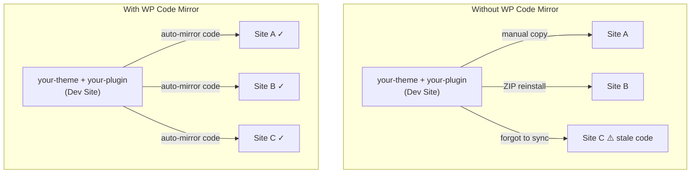
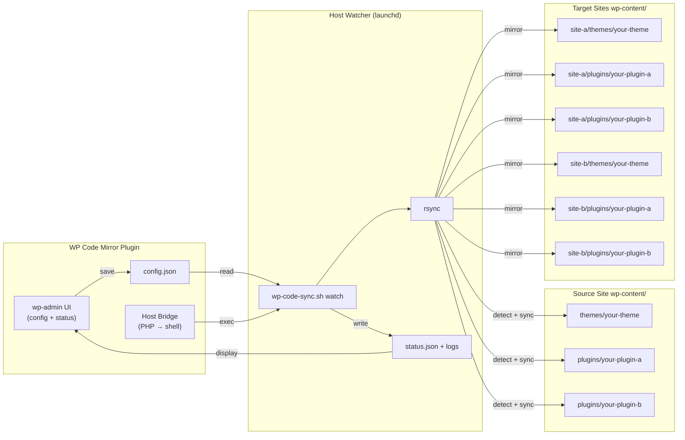

# WP Code Mirror

> Test your themes or plugins across many WordPress sites from one working codebase.

WP Code Mirror helps WordPress developers keep one in-development theme or
plugin aligned across many local WordPress sites. Instead of reinstalling ZIPs,
copying folders manually, or maintaining duplicate code trees, you work from a
single source of truth and mirror that code into your target sites.

## Quick Start

Clone the repository directly into your WordPress plugins directory:

```bash
git clone <repo-url> wp-content/plugins/wp-code-mirror
```

Then:

1. activate the `WP Code Mirror` plugin in wp-admin
2. open `Tools -> WP Code Mirror`
3. update the source and target site paths
4. click `Save Config`
5. install and start the watcher for your target site

`config/wp-code-mirror.config.example.json` is optional. Use it if you want to pre-seed the setup outside wp-admin or keep the first config under file control from the start. Otherwise the plugin will create a site-local config at `wp-content/uploads/wp-code-mirror/config/wp-code-mirror.config.json` when you save the form.

## What It Does

- keeps one local theme or plugin codebase as the source of truth
- mirrors that code into one or more WordPress test sites
- surfaces sync and watcher status inside wp-admin
- reduces duplicate-copy maintenance in local development workflows

## Why This Exists

If you develop WordPress code locally, you usually do not stop at one site.

You build in one working install, then verify the same code in:

- smoke sites
- client-like setups
- sites with different plugin stacks
- sites with different content and design contexts

That is where local development starts to break down. The source site has the
latest code, the test sites drift out of date, and maintaining those copies
becomes work on its own.

WP Code Mirror is built to remove that friction.



## How It Works

WP Code Mirror uses two parts:

1. A WordPress admin plugin
   - manages mirror config
   - shows watcher status
   - exposes sync and service controls

2. A host-side watcher/service layer
   - mirrors selected theme and plugin directories
   - keeps target sites aligned automatically
   - writes status snapshots and logs that wp-admin can display

The working model is simple:

- choose one local WordPress install as the source of truth
- select the theme/plugin code you are actively developing
- configure one or more target WordPress sites
- let the watcher keep those targets in sync



## Current Limitations

- Early macOS-first prototype.
- The watcher service currently depends on `rsync`, `jq`, and `launchd`.
- It is focused on local development, not deployment.
- It syncs code only, not content or databases.

## Who It Is For

WP Code Mirror is for WordPress developers who:

- build themes or plugins locally
- test across multiple local sites
- want one working codebase instead of many stale copies
- are tired of ZIP reinstall loops and manual sync work

## License

MIT. See [`LICENSE`](LICENSE).
